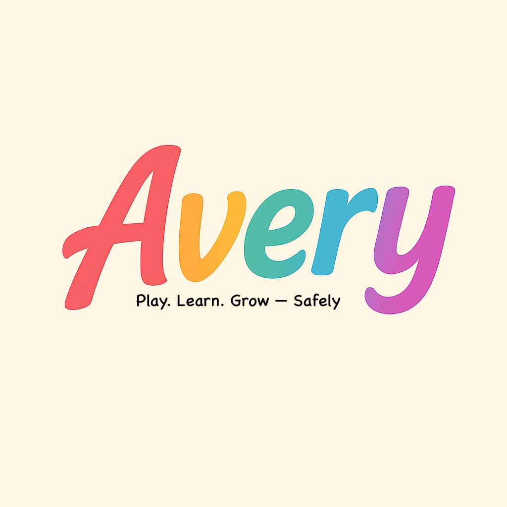

# 🤖 Avery: Your Child’s First AI Friend That Cares

> _"Play. Learn. Grow — Safely."_

Avery is a cuddly companion designed to grow with your child. It’s not just a toy — it’s a friend that listens, learns, and helps keep kids safe while they explore the world.

> **Note:** This is a prototype project. We’re building it with love and care, not for profit.

---

# Avery

  
Avery is a voice-enabled AI toy that listens, learns, and helps kids explore safely. It’s designed to be a caring companion, not just another gadget.

We believe every child deserves a friend who listens — and every parent deserves peace of mind.

---

## 🎯 What Is Avery?

Avery is a **voice-enabled toy** designed for:

- 🧠 **Learning & Interaction** – answers questions, tells stories, sings songs
- 🛡️ **Safety Awareness** – detects distress words and notifies parents
- ☁️ **Secure Recording** – stores important interactions (like a nanny cam)
- 🌐 **Internet-Aware** – fetches facts, weather, and news with parental filters

All powered by **local and cloud-based AI** — with privacy-first thinking.

---

## 🧪 Prototype in Progress

We're currently **planning** Avery's brain using lightweight AI models and Docker:

| Component          | Status     | Description                                |
| ------------------ | ---------- | ------------------------------------------ |
| 🗣️ Whisper Service | 📋 Planned | Speech-to-text (STT)                       |
| 💬 LLM Service     | 📋 Planned | Replies to the child's voice               |
| 🔊 TTS Service     | 📋 Planned | Speaks responses using natural voice       |
| 🚨 Alert Service   | 📋 Planned | Flags distress keywords and alerts parents |

Avery's services will be built modularly using **FastAPI + Docker** so they can run locally or on small devices like the **Raspberry Pi Zero 2W**.

---

## 🚀 Development Status

This project is currently in the **concept and planning phase**.

**Coming soon:**

- Initial service architecture
- Docker containerization setup
- Basic FastAPI endpoints
- Integration testing

**Stay tuned** for updates as we bring Avery to life!

---

## 🙌 Support This Idea

If you like where Avery is going and want to help it grow:

☕ [Buy me a coffee](https://www.buymeacoffee.com/dcfrancisco)

---

## 📦 Roadmap

- [ ] Polish voice-to-text pipeline
- [ ] Add simple parental dashboard
- [ ] Train keyword detection
- [ ] Explore child-safe responses with small LLMs
- [ ] Test on Raspberry Pi

---

## 🤝 Let’s Build Avery Together

This is just the beginning. If you're passionate about ethical AI for kids, privacy, or early learning tools — open a PR, submit ideas, or just say hi!

---

**Avery is not a surveillance tool. It’s a caring companion. Built with heart, not hype.**
